# Guía paso a paso: `.gitignore` en un repositorio

En este punto vamos a aprender a utilizar un archivo `.gitignore` específico para un proyecto.

## 1. Creando y  comprobando la configuracion del archivo a nivel global `.gitignore`

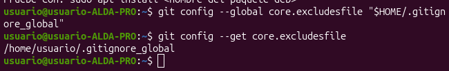
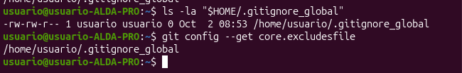

## 2. Editando archivo .gitignore para su configuracion y ignore las distintas pruebas a continuacio:

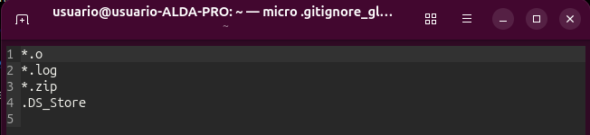

## 3.  Creacion de archivos y carpetas

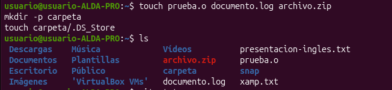

## 4. Comprobacion del funcionamiento de ignorar los archivos.

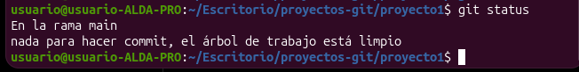

## 5. Creacion .gitignore a nivel local y configuracion del mismo para que ignore lo posteriormente creado.

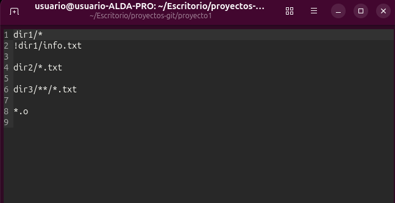

## 6.  Creacion de archivos y carpetas.

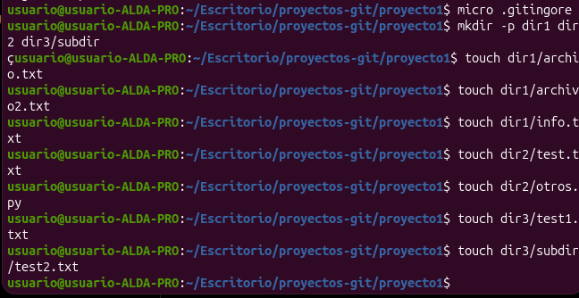

## 7. Comprobacion del funcionamiento.

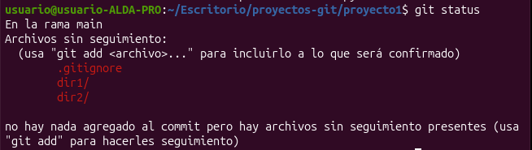

## 8. Conexion repositorio local con GITHUB.

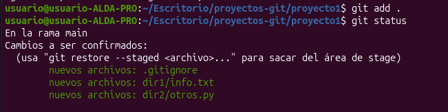
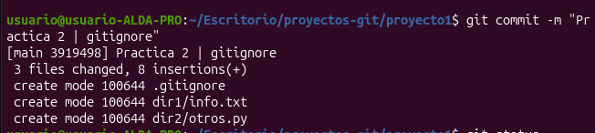
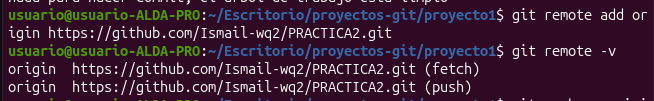
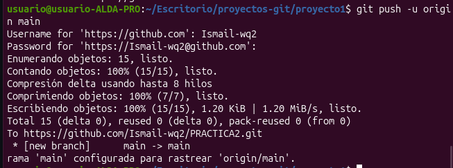

